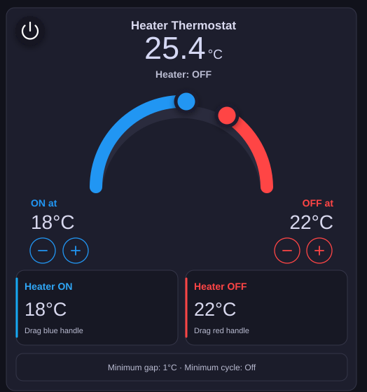

# Heater Thermostat Card for Home Assistant

A complete thermostat controller and draggable dual-handle arc card for electric heaters, oil heaters and radiators.

The integration runs in Home Assistant continuously. The dashboard does **not** need to remain open, and separate heater ON/OFF automations are not required.



## Features

- Continuously controls a physical heater switch from a room-temperature sensor.
- Separate **Heater ON** and **Heater OFF** temperatures.
- Blue and red handles can be dragged directly around the thermostat arc.
- Master automatic-control switch.
- Minimum temperature gap prevents the handles from crossing.
- Minimum cycle duration helps prevent rapid heater switching.
- Fail-safe can turn the heater off if the temperature sensor becomes unavailable.
- Threshold values and enabled state survive Home Assistant restarts.
- Visual dashboard card editor.
- HACS installation with automatic dashboard-resource registration.

## Control logic

Example with ON at `17 °C` and OFF at `22 °C`:

```text
Temperature <= 17 °C  -> Heater ON
Temperature >= 22 °C  -> Heater OFF
Between 17 and 22 °C  -> Keep the current heater state
Thermostat disabled   -> Heater forced OFF
```

## HACS installation

1. Open **HACS**.
2. Open the three-dot menu and choose **Custom repositories**.
3. Add `https://github.com/akugiz/heater-thermostat-card`.
4. Select **Integration**.
5. Install **Heater Thermostat Card**.
6. Restart Home Assistant.
7. Open **Settings → Devices & services → Add integration**.
8. Search for **Heater Thermostat**.
9. Select the temperature sensor and physical heater switch.

## Add the dashboard card

After the integration is configured:

1. Edit a dashboard.
2. Add a card.
3. Search for **Heater Thermostat Card**.
4. Select the **Automatic control** switch created by the integration.

Manual YAML is also supported:

```yaml
type: custom:heater-thermostat-card
entity: switch.heater_thermostat_automatic_control
show_threshold_boxes: true
show_cycle_info: true
```

## Entities created

Each configured thermostat creates:

- A master automatic-control switch.
- A Heater ON temperature number.
- A Heater OFF temperature number.

The card discovers the two threshold entities automatically from the master switch.

## Safety

This software is not a certified safety controller. Keep the heater's built-in thermostat, thermal cutoff and other manufacturer safety systems enabled. Test the setup while you are present before relying on unattended operation.

## Lovelace YAML mode

Automatic card registration works with normal Lovelace storage mode. YAML-mode users must register this module manually:

```yaml
resources:
  - url: /heater_thermostat/heater-thermostat-card.js?v=0.1.1
    type: module
```
